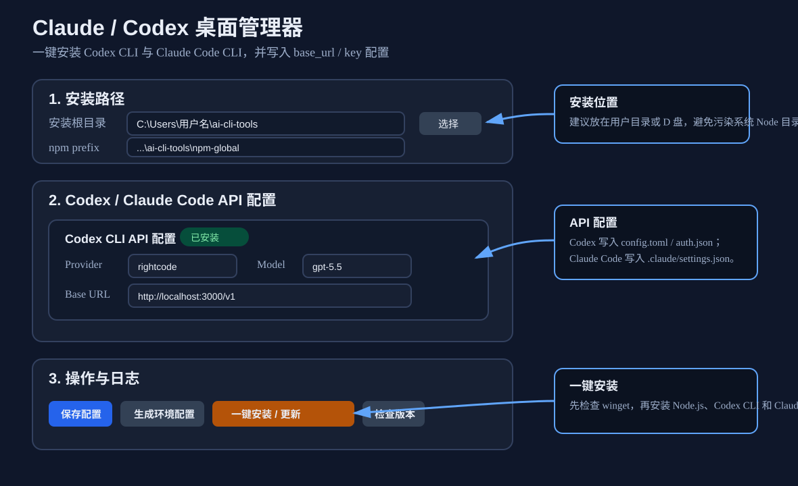
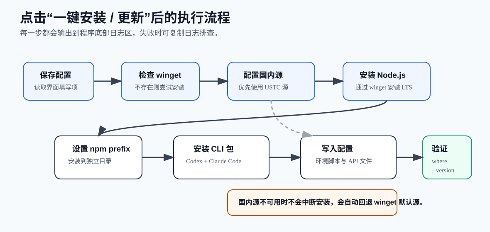
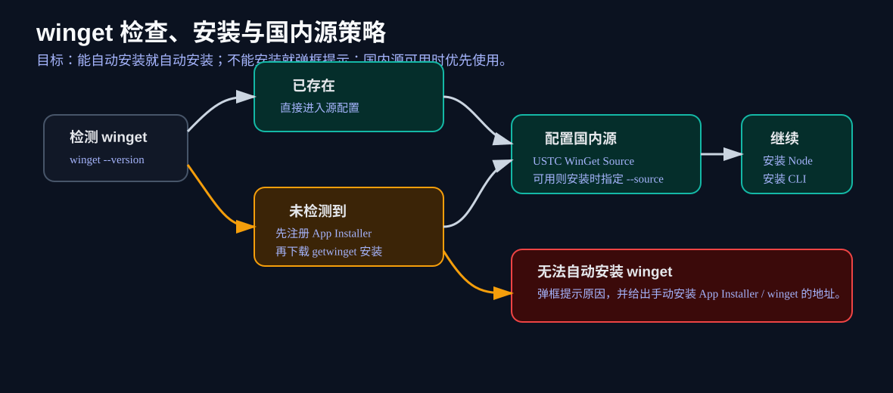

# Claude Codex Manager 使用说明

本文档适用于当前打包产物：

```text
dist\Claude Codex Manager 0.1.0.exe
```

该程序是一个 Windows 桌面工具，用来安装和配置两个命令行工具：

- OpenAI Codex CLI，npm 包名：`@openai/codex`
- Claude Code CLI，npm 包名：`@anthropic-ai/claude-code`

程序会尽量自动准备 `winget`、`Node.js`、`npm`、CLI 包、环境脚本和 API 配置文件。安装过程中可以在界面底部日志区查看详细输出。



## 运行前准备

建议在 Windows 10 或 Windows 11 上运行。第一次使用时，建议右键 exe 选择“以管理员身份运行”，因为以下操作在部分电脑上可能需要更高权限：

- 注册或安装 App Installer / winget
- 添加 winget 国内镜像源
- 通过 winget 安装 Node.js LTS
- 写入用户 PATH

如果不使用管理员身份运行，程序仍会尝试安装；遇到权限不足时，会在日志区显示失败原因，无法自动安装 winget 时会弹框提示。

## 第一步：启动 exe

双击运行：

```text
dist\Claude Codex Manager 0.1.0.exe
```

启动后，程序会自动扫描当前电脑是否已经安装 `codex` 和 `claude` 命令，并在界面中显示状态。

如果 Windows 弹出安全提示，确认程序来源是本仓库打包产物后再继续运行。

## 第二步：确认安装目录

界面上方有两个路径：

- 安装根目录：用于保存环境脚本等辅助文件
- npm 全局 prefix：用于安装 Codex CLI 和 Claude Code CLI

默认建议保持独立目录，例如：

```text
C:\Users\你的用户名\ai-cli-tools
C:\Users\你的用户名\ai-cli-tools\npm-global
```

这样可以避免把 CLI 包安装到系统 Node.js 的全局目录里，后续迁移或清理也更明确。

## 第三步：填写 API 配置

在“配置对象”下拉框中选择要配置的 CLI。

配置 Codex CLI 时，常用字段如下：

| 字段 | 说明 | 示例 |
| --- | --- | --- |
| Package | npm 包名 | `@openai/codex` |
| Codex Provider | Codex 配置里的 provider 名称 | `rightcode` |
| Codex Model | 默认模型名 | `gpt-5.5` |
| Codex Base URL | API 中转地址 | `http://localhost:3000/v1` |
| Codex API Key | Codex 使用的 key | `sk-...` |

配置 Claude Code 时，常用字段如下：

| 字段 | 说明 | 示例 |
| --- | --- | --- |
| Package | npm 包名 | `@anthropic-ai/claude-code` |
| Claude Base URL | Claude Code 使用的 API 地址 | `http://localhost:3000/v1` |
| Claude API Key | Claude Code 使用的 key | `sk-...` |

点击“保存并应用当前 API 配置”时，只会写入当前下拉框选中的 CLI 配置，不会覆盖另一个 CLI 的配置文件。

## 第四步：一键安装

点击：

```text
一键安装 / 更新 Codex + Claude Code
```

程序会按下面流程执行：



流程说明：

1. 保存当前界面配置。
2. 检查 `winget` 是否可用。
3. 如果没有 `winget`，先尝试注册系统已有的 App Installer；仍不可用时下载并安装 Microsoft App Installer。
4. 如果可以配置国内源，优先添加并使用中科大 WinGet 源。
5. 检查 `node` 和 `npm`。如果缺失，通过 winget 安装 `OpenJS.NodeJS.LTS`。
6. 设置 npm 全局 prefix。
7. 执行 `npm install -g` 安装 Codex CLI 和 Claude Code CLI。
8. 写入环境脚本、Codex 配置、Claude Code 配置。
9. 重新扫描并验证 `codex --version` 和 `claude --version`。

## winget 和国内镜像源策略

新版 exe 增加了 winget 兜底处理。



程序会先执行：

```cmd
winget --version
```

如果检测不到 `winget`，会依次尝试：

1. 注册系统中的 App Installer / winget：

   ```powershell
   Add-AppxPackage -RegisterByFamilyName -MainPackage Microsoft.DesktopAppInstaller_8wekyb3d8bbwe
   ```

2. 如果注册后仍不可用，下载 Microsoft 官方 App Installer 包：

   ```text
   https://aka.ms/getwinget
   ```

3. 安装后再次检测 `winget`。

如果仍然失败，程序会弹框提示“无法自动安装 winget”，并给出失败详情和手动安装地址。

国内源策略：

```text
https://mirrors.ustc.edu.cn/winget-source
```

如果该源添加成功，程序安装 Node.js 时会优先指定国内源；如果添加失败，不会中断安装，会自动回退 winget 默认源。

## 生成的文件

安装或应用配置后，会生成或更新以下文件。

环境脚本：

```text
安装根目录\ai-cli-env.cmd
安装根目录\ai-cli-env.sh
```

Codex CLI 配置：

```text
%USERPROFILE%\.codex\config.toml
%USERPROFILE%\.codex\auth.json
```

Claude Code 配置：

```text
%USERPROFILE%\.claude\settings.json
```

程序写入 Codex 配置前会备份已有配置文件，备份文件名类似：

```text
config.toml.bak.20260530_004500
auth.json.bak.20260530_004500
```

## 安装后验证

点击“检查版本”或“重新扫描安装状态”，程序会检测：

```cmd
where codex
codex --version
where claude
claude --version
```

也可以打开新的 PowerShell 或 CMD 手动验证：

```cmd
codex --version
claude --version
```

如果新终端里提示找不到命令，先关闭所有终端窗口，再重新打开。用户 PATH 更新后，旧终端通常不会立即读取新的环境变量。

## 常见问题

### 1. 提示无法自动安装 winget

可能原因：

- Windows 版本过旧
- App Installer 被系统策略禁用
- 当前用户权限不足
- 网络无法访问 Microsoft App Installer 下载地址

处理方式：

1. 尝试以管理员身份重新运行 exe。
2. 手动安装 App Installer / winget。
3. 安装完成后重新打开本程序，再点“一键安装 / 更新”。

### 2. 国内源添加失败

国内源添加失败不会阻止安装。程序会回退 winget 默认源。

如果希望手动配置，可以在管理员 PowerShell 中执行：

```powershell
winget source add --name ustc --arg https://mirrors.ustc.edu.cn/winget-source --trust-level trusted --accept-source-agreements
winget source update --name ustc
```

### 3. Node.js 安装后仍检测不到 npm

可能是当前程序进程没有读取到最新 PATH。处理方式：

1. 关闭本程序。
2. 重新打开 exe。
3. 再点“一键安装 / 更新”。

### 4. 安装 npm 包失败

查看日志区里的 npm 输出。常见原因包括网络问题、npm registry 不可用、权限不足。

可以先检查：

```cmd
npm --version
npm config get registry
```

确认 npm 可用后，再重新点击“一键安装 / 更新”。

### 5. API Key 是否会显示在日志中

程序日志会对常见 `sk-...` key 和 `Bearer ...` 内容做脱敏处理。但仍建议不要把完整日志公开到不可信环境中。

## 推荐操作顺序

首次使用时建议按下面顺序：

1. 以管理员身份运行 exe。
2. 确认安装根目录和 npm prefix。
3. 填写 Codex CLI API 配置，点击“保存并应用当前 API 配置”。
4. 切换到 Claude Code，填写 Claude API 配置，点击“保存并应用当前 API 配置”。
5. 点击“一键安装 / 更新 Codex + Claude Code”。
6. 等待日志完成后，点击“检查版本”。
7. 打开新的 PowerShell，执行 `codex --version` 和 `claude --version` 验证。

## 卸载和清理

如需清理本工具安装的 CLI 包，可以在 PowerShell 或 CMD 中执行：

```cmd
npm uninstall -g @openai/codex
npm uninstall -g @anthropic-ai/claude-code
```

然后按需删除安装根目录，例如：

```text
C:\Users\你的用户名\ai-cli-tools
```

如果不再使用相关 API 配置，也可以手动删除：

```text
%USERPROFILE%\.codex
%USERPROFILE%\.claude\settings.json
```
